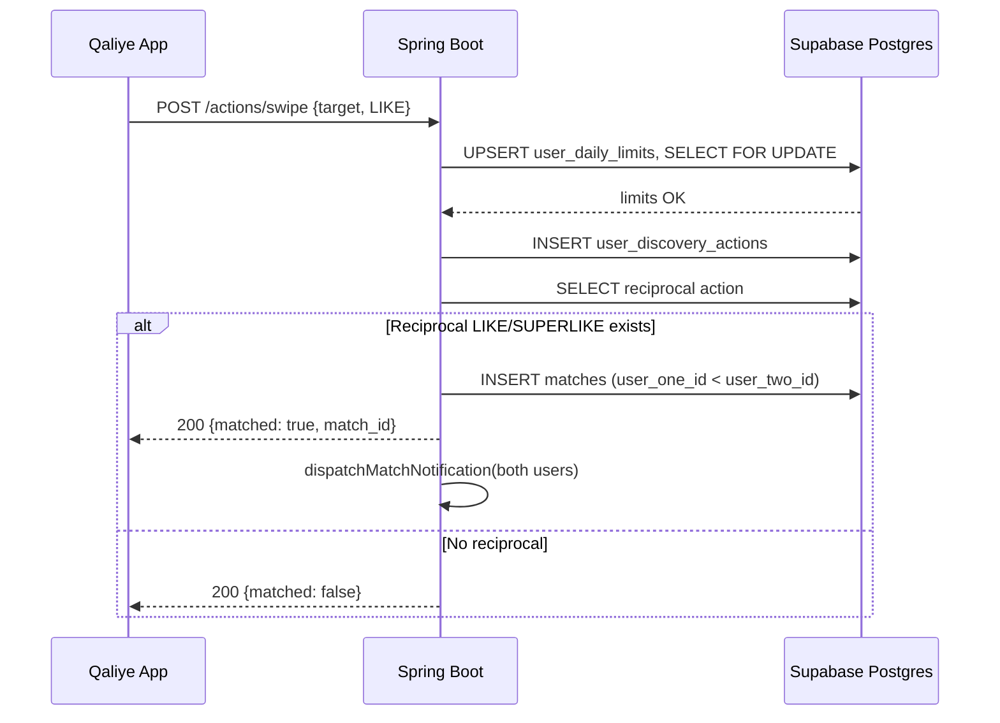

# Qaliye — Unified Architecture & Implementation Guide

**Version:** 2.1 — Spring Boot-mediated data access
**Audience:** AI coding agents (client agent · backend agent) and human engineers
**Scope:** React Native (Expo SDK 56) client · Spring Boot OAuth2 Resource Server · Supabase (Postgres + PostGIS + Auth + Storage + Realtime)

---

## 0. Purpose & How to Use This Document

This is the single source of truth for building **Qaliye** — a culturally-aware dating app serving Ethiopian and Eritrean communities locally and in the diaspora.

The database schema in `schema.sql` is **complete and production-ready**. Do not alter it without a corresponding update to this document. This guide:

1. Documents **every table** in `schema.sql` — its purpose, constraints, and behavioral implications.
2. Defines a **Spring Boot-first security boundary**: the mobile client does not directly read or mutate application tables except for chat message reads/realtime.
3. Provides **concrete configuration** for both the Expo client and Spring Boot server.
4. Specifies the **full API contract** between client and backend.
5. Gives a **phased roadmap** so agents build incrementally without breaking earlier work.

> **Rule for agents:** The Expo client may call Supabase directly only for **Auth/session** and **chat message receive paths**: initial `messages` read for a known `match_id` and Supabase Realtime subscriptions for chat message inserts/updates. All other app data, including profiles, preferences, photos, blocks, reports, push tokens, verification, payments, discovery, swipes, matches, and admin actions, MUST go through Spring Boot.
>
> **Photo upload rule:** Profile photos, verification selfies, and payment receipts are uploaded to Spring Boot as multipart requests. Spring Boot validates the authenticated user, writes the object to Supabase Storage using the service-role key, and creates/updates database metadata in the same trusted flow.

---

## 1. System Overview & Design Philosophy

The system follows a **Spring Boot-mediated three-tier architecture**. Supabase remains the system of record for Auth, Postgres, Storage, and Realtime, but the mobile client does not directly interact with application tables or Storage buckets.

> **Default rule:** If the user is authenticated and the operation reads or changes app data, route it through Spring Boot. The only direct Supabase exceptions are Auth/session and chat message receive paths.

This model intentionally trades a small amount of extra backend traffic for a much cleaner security boundary:

- Spring Boot performs one consistent `app_users.status` check for every app operation.
- Trusted fields such as `profiles.is_verified`, `profiles.is_onboarded`, `profile_completion_score`, photo moderation status, subscription state, and payment status cannot be spoofed by the client.
- Storage objects are never written directly by the client; the backend validates file type, size, ownership, and metadata before writing to Supabase Storage.
- Supabase RLS is still useful for the narrow direct chat read/realtime path, but it is no longer the primary application authorization layer.

| Tier | Technology | Responsibility |
|---|---|---|
| **Client** | React Native (Expo SDK 56) · Zustand · React Query · NativeWind · Axios · Supabase Auth/Realtime client | UI, local state, server-state cache, Supabase Auth/session, chat message initial read + realtime receive, Axios calls to Spring Boot for all app data and uploads |
| **Resource Server** | Spring Boot 3.x · stateless · OAuth2 Resource Server | All app APIs, profile/preferences, file uploads, discovery, swipe/match logic, messaging gatekeeper, payments, verification, moderation, push notifications |
| **Database/Platform** | Supabase (Postgres 15 + PostGIS + Auth + Storage + Realtime) | Auth issuer, single source of truth, private object storage, realtime event transport for chat messages; Spring Boot connects via direct JDBC and service-role Storage API |

---

## 2. High-Level Architecture

```mermaid
graph TB
    subgraph Client["📱 Qaliye — React Native (Expo SDK 56)"]
        A1[Supabase JS Client - Auth/session only]
        A2[Axios API Client - all app data + uploads]
        A3[Chat Realtime Hub - messages receive only]
        A4[Zustand - local/session state]
        A5[React Query - backend state cache]
    end

    subgraph Supabase["🗄️ Supabase Platform"]
        B1[Auth — JWT Issuer & JWKS endpoint]
        B2[(Postgres 15 + PostGIS)]
        B3[Private Storage Buckets]
        B4[Realtime — postgres_changes on messages]
    end

    subgraph SpringBoot["⚙️ Spring Boot 3.x — Stateless Resource Server"]
        C1[JWT Filter — JWKS validation, sub → UUID]
        C2[Account/Profile/Preferences APIs]
        C3[Backend Upload Service — photos, selfies, receipts]
        C4[Discovery Engine — PostGIS spatial query]
        C5[Swipe & Match Service — daily limits + canonical ordering]
        C6[Messaging Gatekeeper — send/read receipts/unmatch]
        C7[Payment Webhooks + Manual Payment Review]
        C8[Verification Service — manual admin review]
        C9[Notification Dispatcher — Expo Push API]
        C10[Moderation/Admin Endpoints — audit_log]
    end

    A1 -- "signUp / signIn / refreshSession" --> B1
    A1 -- "getSession for bearer token" --> A2
    A2 -- "Authorization: Bearer JWT" --> C1
    A2 -- "multipart files + JSON DTOs" --> C2 & C3 & C4 & C5 & C6 & C7 & C8 & C9 & C10
    A3 -- "initial message SELECT + postgres_changes WebSocket" --> B4
    C1 --> C2 & C3 & C4 & C5 & C6 & C7 & C8 & C9 & C10
    C2 & C3 & C4 & C5 & C6 & C7 & C8 & C9 & C10 -- "JDBC direct (BYPASSRLS)" --> B2
    C3 & C8 & C10 -- "Storage REST API (service-role)" --> B3
    B1 -. "/.well-known/jwks.json" .-> C1
    B4 -. "logical replication events" .-> B2
```



**Reading the diagram:**

- The client talks directly to Supabase only for **Auth/session** and **chat receive**. Every other application capability is exposed as a Spring Boot endpoint.
- Spring Boot validates the Supabase-issued JWT against the JWKS endpoint — `sub` claim equals `auth.uid()`.
- Spring Boot connects to Postgres via **direct JDBC** using the database password. This runs with `BYPASSRLS`; therefore Spring Boot must enforce all application authorization explicitly.
- Spring Boot uses the Supabase **service-role key only on the server** for Storage object writes, downloads, deletes, and signed URLs. The service-role key is never exposed to Expo.
- Chat receive still uses Supabase Realtime because it gives low-latency message delivery. Message writes, read receipts, match mutations, and moderation decisions remain Spring Boot-only.

---

## 3. Database Schema — Definitive Reference

`schema.sql` is complete. **Do not add or alter tables without updating this document.** This section documents every table's purpose and behavioral implications for implementing agents.

### 3.1 Extensions & Shared Utilities (schema.sql §1)

- `pgcrypto` — powers `gen_random_uuid()` for every primary key (distributed ID generation, no sequence round-trips).
- `postgis` — required for `GEOGRAPHY(Point, 4326)` in `addresses` and `ST_DWithin` radius queries in the discovery engine.
- `update_updated_at_column()` — single reusable trigger function applied via 13 triggers in §10. One function, many triggers — do not duplicate.

### 3.2 Core Identity & Geography (schema.sql §2)

#### `app_users`
Shadow table for `auth.users`. Supabase Auth owns credentials (email, phone, password, OAuth, MFA). `app_users` extends it with app state:

- `status` (`ACTIVE`, `SUSPENDED`, `DEACTIVATED`) — Spring Boot checks this on every authenticated request; suspended users get `403` before any business logic runs.
- `role` (`USER`, `MODERATOR`, `ADMIN`) — gates moderation and admin endpoints in Spring Boot.
- `preferred_language VARCHAR(10) DEFAULT 'en'` — drives notification copy localization and which `profile_prompt_translations` locale to fetch. Supported v1 values: `en`, `am`, `ti`, `om`.
- `deleted_at` — soft-delete entry point for GDPR right-to-erasure flows.

**`handle_new_auth_user()` trigger** (on `auth.users` AFTER INSERT) — auto-provisions both `app_users` and a default `discovery_preferences` row. This guarantees Spring Boot can return `/api/v1/me` immediately after signup with no race condition. The client should not query these tables directly. **Do not remove this trigger.**

#### `addresses`
Normalized geography table with `GEOGRAPHY(Point, 4326)`. Separated from `profiles` to allow future reuse and because the `GIST` index on `coords` must exist at the `addresses` level for `ST_DWithin` to be fast.

- `location_source` (`GPS`, `MANUAL`, `IP`) — when `MANUAL`, the discovery engine should deprioritize precise-distance sorting (a city centroid coordinate makes "2.3 km away" meaningless).
- Diaspora users selecting "Abroad" during onboarding: insert `location_source = 'MANUAL'` with the chosen city's centroid coordinates.

### 3.3 Profiles, Photos & Discovery Settings (schema.sql §3)

#### `profiles`
The richest table — drives matching quality and discovery ranking.

- `residency_type` (`ETHIOPIA`, `ERITREA`, `DIASPORA`) — core product differentiator. Feeds `discovery_preferences.preferred_residency_types`.
- `profile_completion_score` — **must be computed server-side by Spring Boot** (or a Postgres trigger), never accepted from the client. A client-written score could be spoofed, corrupting discovery ranking.
- `is_visible`, `is_onboarded`, `is_verified` — three independent boolean gates, all checked by `idx_profiles_discovery_bundle` (partial index) and by RLS read policy.
- **Onboarding flow:** The client submits onboarding data to Spring Boot. Spring Boot validates required profile fields, address, preferences, prompt answers, age compliance, and photo prerequisites, then sets `is_onboarded = TRUE` and computes initial `profile_completion_score`. Do not let the client self-set `is_onboarded`.
- **Gender note:** The app does not support same-gender matching. During onboarding, `interested_in_gender` is set automatically: `MALE` user → `FEMALE`, `FEMALE` user → `MALE`.

#### `profile_photos`
- `moderation_status` defaults to `PENDING` — correct for dating apps. A photo is invisible to other users until `APPROVED` by the moderation pipeline.
- `unique_user_photo_order UNIQUE (user_id, photo_order)` — prevents ordering conflicts.
- `unique_primary_photo_per_user` (partial unique index in schema §9, `WHERE is_primary = TRUE`) — **already in schema**. Enforces **at most one** primary photo per user at the database level. Spring Boot must enforce **at least one approved primary photo** before a profile becomes visible in discovery.

#### `discovery_preferences`
Auto-provisioned by `handle_new_auth_user()` trigger with safe defaults. Key fields:

- `discovery_mode`: `STANDARD` (radius-based), `GLOBAL` (ignore distance — for diaspora seeking partners back home), `INCOGNITO` (user browses but never appears in others' decks).
- `preferred_residency_types TEXT[]` — multi-select array of `ETHIOPIA`/`ERITREA`/`DIASPORA`.
- `check_age_range CHECK (min_age <= max_age)` — enforced at DB level.

### 3.4 Age Compliance (schema.sql §3.5)

The schema enforces 18+ via a `BEFORE INSERT OR UPDATE` trigger (`enforce_profile_age_compliance`) on `profiles`:

```sql
IF NEW.date_of_birth > CURRENT_DATE - INTERVAL '18 years' THEN
    RAISE EXCEPTION 'Age Compliance Violation: ...';
END IF;
```

> ⚠️ **For Spring Boot agent:** This trigger raises a `PSQLException`. Catch it and return `400 Bad Request` with message `"You must be at least 18 years old to register."`. Do not surface the raw Postgres exception to the client.
>
> **For client agent:** Also enforce the 18+ rule client-side in the date-of-birth picker (disable dates within 18 years of today). This is a dual-layer guard: client UX + database enforcement.

### 3.5 Swiping Engine & Rate Limiting (schema.sql §4)

#### `user_discovery_actions`
Records every `LIKE` / `PASS` / `SUPERLIKE`. Key constraints:

- `UNIQUE (actor_user_id, target_user_id)` — one action per pair, ever. Passed profiles never resurface by default. Spring Boot catches unique-violation on retry and returns the prior result (idempotent).
- `check_not_self_action` — prevents self-swipe at DB level.
- **RLS:** enabled but no client-accessible policies → **all writes go through Spring Boot service-role only**. The client never writes to this table directly.

#### `user_daily_limits`
Composite PK `(user_id, limit_date)` — daily resets are handled automatically; each new date creates a new row (upsert on `CURRENT_DATE`). Tracks `likes_used`, `super_likes_used`, `rewinds_used`.

- `CURRENT_DATE` is UTC (database server timezone). Daily limits reset at midnight UTC. Document this in the app's help/FAQ.
- Tier limits come from the active subscription plan's `features` JSONB field (e.g., `{"likes_per_day": 10, "super_likes_per_day": 1, "rewinds_per_day": 0}`). Spring Boot reads this at swipe time (cache 5 minutes).

### 3.6 Matches & Messaging (schema.sql §5)

#### `matches`
Canonical pair ordering: `check_user_order CHECK (user_one_id < user_two_id)` combined with `unique_match_pair UNIQUE (user_one_id, user_two_id)` ensures a match between any two users is stored exactly once, regardless of who liked first.

> ⚠️ **Spring Boot agent:** Match creation MUST sort UUIDs before insert:
> ```java
> UUID userOne = actorId.compareTo(targetId) < 0 ? actorId : targetId;
> UUID userTwo = actorId.compareTo(targetId) < 0 ? targetId : actorId;
> ```
> Skipping this causes a `CHECK` violation on roughly half of all matches.

`last_message_at`, `user_one_last_read_at`, `user_two_last_read_at` — power unread-count badges and chat-list sorting with no extra table. Read-receipt update: `PATCH /api/v1/matches/{id}/read` (Spring Boot).

#### `messages`
- `client_message_id UUID` + `UNIQUE (sender_user_id, client_message_id)` — **optimistic-send deduplication pattern**. Client generates UUID locally, shows message immediately, sends to Spring Boot. On network retry, the unique constraint silently no-ops the duplicate insert — Spring Boot returns the original row.
- `moderation_status DEFAULT 'APPROVED'` — intentional for chat UX (pre-moderation adds latency). Async moderation pipeline (Section 6.11) can retroactively set `REJECTED_FLAGGED`, which immediately hides the message via RLS.
- **Client agent:** Handle message disappearance gracefully — a `REJECTED_FLAGGED` update from Realtime should remove the message from the chat UI without crashing.

### 3.7 Trust, Safety & Verification (schema.sql §6)

#### `user_blocks`
Composite PK `(blocker_user_id, blocked_user_id)`. `idx_blocks_reverse` index makes both directions of block lookup index-backed — critical for the discovery engine's bidirectional exclusion query. **Auto-unmatch on block** is implemented in Spring Boot's `POST /api/v1/safety/block` endpoint (preferred over a trigger since it also emits analytics events).

#### `user_reports`
`related_message_id` links reports directly to the offending message. Status flow: `PENDING → UNDER_REVIEW → RESOLVED_NO_ACTION | RESOLVED_BANNED`. The client submits reports through Spring Boot (`POST /api/v1/safety/report`); Spring Boot validates the reporter, target user/message, creates the report, and exposes moderation queues via admin endpoints.

#### `user_verifications`
Stores the outcome of each verification attempt. **MVP approach: manual admin review only** — no third-party KYC or automated liveness provider in v1.

**Required schema amendment** — add these columns before Phase 5:

```sql
ALTER TABLE user_verifications
  ADD COLUMN storage_path       TEXT,
  ADD COLUMN reviewed_by        UUID REFERENCES app_users(id) ON DELETE SET NULL,
  ADD COLUMN rejection_reason   TEXT,
  ADD COLUMN metadata           JSONB DEFAULT '{}';

-- Keep provider_reference_id nullable (already optional) for future provider integrations
```

Column semantics for MVP:

| Column | MVP value | Future use |
|---|---|---|
| `verification_type` | `'SELFIE_MATCH'` | `'GOVERNMENT_ID'` when ID doc verification is added |
| `provider` | `'MANUAL_ADMIN'` | `'aws_rekognition'`, `'jumio'`, etc. |
| `provider_reference_id` | `NULL` | Third-party job/session ID |
| `storage_path` | `{user_id}/{verification_id}.jpg` in bucket `verification-selfies` | Same path convention |
| `reviewed_by` | UUID of moderator who approved/rejected | Same |
| `rejection_reason` | Human-readable text from moderator | Liveness provider rejection code |
| `metadata` | `{}` | Future: liveness confidence score, face-match score |

On `APPROVED`: Spring Boot performs `UPDATE profiles SET is_verified = TRUE WHERE user_id = :userId`. The client reads verification status only through Spring Boot (`GET /api/v1/verification/status`) — **never** directly from `user_verifications`, and never the `storage_path` or `reviewed_by` fields.

#### `audit_log`
Records all `MODERATOR`/`ADMIN` actions. Key fields:
- `actor_user_id UUID` — **nullable** (references `app_users` ON DELETE SET NULL). A moderator account deletion must not wipe audit history.
- `target_table`, `target_id`, `details JSONB` — provide full context for dispute resolution.
- No RLS — **Spring Boot service-role writes only**. No client access.

#### `notification_devices`
`UNIQUE (device_token)` prevents duplicate registrations across re-installs. The client sends the Expo push token to Spring Boot (`POST /api/v1/notifications/devices`); Spring Boot performs `UPSERT ON CONFLICT (device_token)` to reassign `user_id` safely when the same device token is re-registered under a different account. `idx_notification_devices_user WHERE is_active = TRUE` keeps push-fanout queries fast.

### 3.8 Revenue & Monetization (schema.sql §7)

#### `subscription_plans`
`UNIQUE (plan_code, country_code)` with `country_code DEFAULT 'GLOBAL'` enables regional pricing — same `plan_code` priced in ETB for Ethiopia residents and USD/GBP for diaspora. See Section 11 for seed data.

#### `user_subscriptions` & `transactions`
`provider` enum covers global rails (`STRIPE` for card/web, `APPLE_APP_STORE` / `GOOGLE_PLAY` via RevenueCat IAP) and local Ethiopian rails (`TELEBIRR`, `CBE_BIRR`, `CHAPA`, `BANK_TRANSFER`). Dual-rail is the most important monetization decision — without local rails, Ethiopia/Eritrea-based users cannot pay.

- `APPLE_APP_STORE` / `GOOGLE_PLAY` — handled through **RevenueCat** unified webhooks. RevenueCat's `event.store` maps to the DB provider (`app_store` → `APPLE_APP_STORE`, `play_store` → `GOOGLE_PLAY`).
- `transactions.receipt_image_url` + `admin_notes` + `status = 'MANUAL_REVIEW'` — used for all local methods (`CHAPA`, `TELEBIRR`, `CBE_BIRR`, `BANK_TRANSFER`). Despite the legacy column name, the client must not provide a public URL. Spring Boot accepts a receipt file via multipart, stores it in the private `payment-receipts` bucket, and writes a backend-owned storage reference or signed/proxy URL strategy into the transaction record. Admin approves via `PATCH /api/v1/admin/transactions/{id}`.
- `provider_transaction_id UNIQUE` + `payment_events.provider_event_id UNIQUE` — **webhook idempotency at the DB level**. Spring Boot does `INSERT ... ON CONFLICT DO NOTHING`; if 0 rows affected it's a duplicate delivery → return `200 OK` immediately.

#### `active_boosts`
Tracks live profile boosts. Fields: `user_id`, `transaction_id` (FK), `started_at`, `expires_at`. The discovery engine orders by `EXISTS (SELECT 1 FROM active_boosts WHERE user_id = p.user_id AND expires_at > NOW())` descending — boosted profiles surface first within existing eligibility filters. Boosts change **ranking only, never eligibility**. `idx_active_boosts_user_expiry` should be a normal B-tree index on `(user_id, expires_at)`. Do **not** use a partial index with `CURRENT_TIMESTAMP` because time-dependent predicates are not stable for index membership.

### 3.9 Cultural Profile Prompts (schema.sql §8)

Three tables implement the "Hinge-style" prompt feature:

- `profile_prompts` — master prompt list (`prompt_text` = English/default fallback, `category`, `is_active`).
- `profile_prompt_translations` — locale translations (`prompt_id`, `locale`, `prompt_text`). **Already in schema.** Supported v1 locales: `en`, `am`, `ti`, `om`. Client fetches prompts in `preferred_language`, falling back to English if no translation exists.
- `profile_prompt_answers` — user responses (`user_id`, `prompt_id`, `answer_text`). `UNIQUE (user_id, prompt_id)` — one answer per prompt per user. **Backend-mediated access:** The client must not query `profile_prompt_answers` directly. Prompt answers are written through Spring Boot during onboarding/profile editing and returned through Spring Boot DTOs such as discovery cards and profile detail. This avoids exposing answers for arbitrary `user_id` values and makes the missing/weak RLS policy non-blocking for the client surface.

Seed `profile_prompts` with culturally resonant prompts (see Section 11).

### 3.10 Performance Indexes (schema.sql §9)

Key indexes and their purpose:

- `idx_profiles_discovery_bundle` — partial index on `(gender, residency_type) WHERE is_visible AND is_onboarded`. Primary filter for the discovery engine — eliminates ineligible profiles before spatial or age computation.
- `idx_profiles_date_of_birth` — B-tree on `date_of_birth`. Supports `BETWEEN` range queries for age filtering (age is computed from DOB at query time).
- `idx_addresses_coords` — GIST spatial index. Required for `ST_DWithin` performance.
- `idx_blocks_reverse ON user_blocks(blocked_user_id, blocker_user_id)` — makes both directions of block lookup index-backed.
- `idx_active_boosts_user_expiry` — B-tree index on `(user_id, expires_at)`. Fast boost check in discovery `ORDER BY`; avoid time-dependent partial index predicates such as `WHERE expires_at > CURRENT_TIMESTAMP`.
- `unique_primary_photo_per_user` — partial unique index `ON profile_photos(user_id) WHERE is_primary = TRUE`. **Already in schema.** Enforces at most one primary photo at DB level; Spring Boot enforces at least one approved primary photo before discovery visibility.
- `idx_messages_match_not_deleted` — partial index `WHERE deleted_at IS NULL`. Chat history query never scans deleted messages.

### 3.11 RLS Policy Reference (schema.sql §11-12)

Because this guide now uses a **Spring Boot-first access model**, RLS is a defense-in-depth mechanism, not the main application API boundary. Client table access should be disabled for every table except the narrow chat receive path.

| Table | RLS enabled | Client direct write | Client direct read | Runtime path |
|---|---|---|---|---|
| `app_users` | ✅ | ❌ | ❌ | Spring Boot `/api/v1/me`; Auth trigger provisions row |
| `addresses` | ✅ recommended | ❌ | ❌ | Spring Boot profile/onboarding APIs |
| `profiles` | ✅ | ❌ | ❌ | Spring Boot DTOs only |
| `profile_photos` | ✅ | ❌ | ❌ | Spring Boot upload/moderation/profile DTOs only |
| `discovery_preferences` | ✅ | ❌ | ❌ | Spring Boot `/api/v1/discovery/preferences` |
| `profile_prompts` | ✅/readable via API | ❌ | ❌ | Spring Boot `/api/v1/profile/prompts` |
| `profile_prompt_translations` | ✅/readable via API | ❌ | ❌ | Spring Boot `/api/v1/profile/prompts?locale=...` |
| `profile_prompt_answers` | ✅ recommended | ❌ | ❌ | Spring Boot profile/discovery DTOs only |
| `user_discovery_actions` | ✅ | ❌ | ❌ | Spring Boot only |
| `user_daily_limits` | ✅ | ❌ | ❌ | Spring Boot only |
| `matches` | ✅ | ❌ | ❌ by default | Spring Boot `/api/v1/matches`; no direct match-list queries |
| `messages` | ✅ | ❌ | ✅ own accepted match messages only | Spring Boot sends; Supabase initial chat read + Realtime receive |
| `user_blocks` | ✅ | ❌ | ❌ | Spring Boot `/api/v1/safety/block` |
| `user_reports` | ✅ | ❌ | ❌ | Spring Boot `/api/v1/safety/report` |
| `notification_devices` | ✅ | ❌ | ❌ | Spring Boot `/api/v1/notifications/devices` |
| `subscription_plans` | optional | ❌ | ❌ | Spring Boot `/api/v1/billing/plans` |
| `user_subscriptions` | ❌/server-only | ❌ | ❌ | Spring Boot DTO |
| `transactions` | ❌/server-only | ❌ | ❌ | Spring Boot DTO/admin |
| `payment_events` | ❌/server-only | ❌ | ❌ | Spring Boot webhook only |
| `audit_log` | ❌/server-only | ❌ | ❌ | Spring Boot admin only |
| `active_boosts` | ❌/server-only | ❌ | ❌ | Spring Boot payment/discovery only |
| `user_verifications` | ❌/server-only | ❌ | ❌ | Spring Boot status/admin only |

**Direct Supabase exception:** `messages` may be read directly only for a chat screen where the user already has a `match_id` obtained from Spring Boot. The RLS policy must require an `ACCEPTED` match participant, `messages.deleted_at IS NULL`, and `messages.moderation_status = 'APPROVED'`.

**Key messages RLS note:** When Spring Boot sets `moderation_status = 'REJECTED_FLAGGED'`, Realtime emits an UPDATE event. The message immediately fails the SELECT policy (`moderation_status = 'APPROVED'`), so it disappears from both participants' chat. The client must handle mid-render message removal gracefully (see Module 6).

### 3.12 Realtime Configuration (schema.sql §13)

Only `messages` is required for the client-facing Realtime path in this Spring Boot-first model.

- `messages` should be added to the `supabase_realtime` publication with `REPLICA IDENTITY FULL` so UPDATE/DELETE events include old row data.
- `matches` may remain in the publication for backend/admin tooling or future UI features, but the MVP client should not rely on direct `matches` Realtime. The client obtains match lists and match status from Spring Boot.
- Message RLS must ensure the subscribed user is a participant in an `ACCEPTED` match and only receives messages that are `APPROVED` and not deleted.

---

## 4. Environment Variables & Configuration

### 4.1 Expo Client (`.env` / EAS secrets)

```env
EXPO_PUBLIC_SUPABASE_URL=https://<project-ref>.supabase.co
EXPO_PUBLIC_SUPABASE_ANON_KEY=<anon-key>
EXPO_PUBLIC_API_BASE_URL=https://api.yourdomain.com
```

- `EXPO_PUBLIC_*` variables are inlined at build time by Expo. Never put secrets here.
- `SUPABASE_ANON_KEY` is the public anon key — safe to expose; RLS enforces access.

### 4.2 Spring Boot (`application.yml` + environment secrets)

```yaml
spring:
  security:
    oauth2:
      resourceserver:
        jwt:
          # Supabase JWKS endpoint — validates all client-issued JWTs
          jwk-set-uri: https://<project-ref>.supabase.co/auth/v1/.well-known/jwks.json
  datasource:
    # Direct Postgres connection — bypasses RLS (runs as postgres / BYPASSRLS)
    url: jdbc:postgresql://db.<project-ref>.supabase.co:5432/postgres
    username: postgres
    password: ${SUPABASE_DB_PASSWORD}
    hikari:
      maximum-pool-size: 10
      connection-timeout: 20000
  jpa:
    properties:
      hibernate:
        dialect: org.hibernate.dialect.PostgreSQLDialect
    open-in-view: false

supabase:
  url: ${SUPABASE_URL}
  # Service-role key — only for Storage REST API (signed URLs, moderation downloads)
  service-role-key: ${SUPABASE_SERVICE_ROLE_KEY}
```

**Environment secrets (never commit):** `SUPABASE_DB_PASSWORD`, `SUPABASE_URL`, `SUPABASE_SERVICE_ROLE_KEY`

### 4.3 Supabase Storage Bucket Setup

All Storage buckets are **private** and accessed by the client only through Spring Boot APIs. Do not create client-facing `INSERT`, `UPDATE`, `DELETE`, or broad `SELECT` policies on `storage.objects` for these buckets.

#### Bucket 1: `profile-photos`
- **Access:** Private.
- **Object path:** `{user_id}/{photo_id}.jpg` inside the `profile-photos` bucket. Do not prefix the object name with the bucket name.
- **Write path:** Client sends multipart file to `POST /api/v1/profile/photos`; Spring Boot validates ownership, file size/type, image dimensions, and photo count/order, uploads to Supabase Storage using the service-role key, and inserts the `profile_photos` row with `moderation_status = 'PENDING'`.
- **Read path:** Spring Boot returns approved photo URLs in DTOs. For private buckets, return short-lived signed URLs or proxy image delivery through the backend. Do not use `getPublicUrl()` for a private bucket.

#### Bucket 2: `verification-selfies`
- **Access:** Strictly private.
- **Object path:** `{user_id}/{verification_id}.jpg` inside the `verification-selfies` bucket.
- **Write path:** Client captures a live selfie and submits it as multipart to `POST /api/v1/verification/submit`; Spring Boot uploads the object and creates the `user_verifications` row.
- **Read path:** Only `MODERATOR`/`ADMIN` endpoints receive 10-minute signed URLs generated by Spring Boot. Normal users never receive the selfie URL or storage path.

#### Bucket 3: `payment-receipts`
- **Access:** Strictly private.
- **Object path:** `{user_id}/{transaction_id}.jpg` or `{user_id}/{uuid}.jpg` inside the `payment-receipts` bucket.
- **Write path:** Client submits local-payment proof as multipart to `POST /api/v1/payments/manual`; Spring Boot uploads the receipt and creates the `transactions` row with `status = 'MANUAL_REVIEW'`.
- **Read path:** Admin endpoints return short-lived signed URLs only to `ADMIN` users reviewing manual transactions.

Recommended storage policy posture:

```sql
-- No authenticated client-facing policies on these buckets.
-- Spring Boot uses SUPABASE_SERVICE_ROLE_KEY via Storage REST API.
-- If a temporary development policy is added, it must be removed before production.
```

---

## 5. Client Implementation Guide (React Native / Expo)

### Client Architecture Rules

- **Zustand** — client/local state only: auth session, language, theme, onboarding draft state, temp UI state.
- **React Query** — server state only: Spring Boot API fetches, mutations, pagination, cache invalidation.
- **Axios** — all app data and all file uploads go through `src/api/` services backed by Spring Boot. Never call Axios directly in screens.
- **Supabase JS client** — Auth/session and chat message receive only. It may be used for `supabase.auth.*`, initial `messages` read for an authorized `match_id`, and `messages` Realtime subscriptions. Do not use `supabase.from(...)` for profiles, preferences, blocks, reports, push tokens, payments, verification, or admin data.
- **Storage** — the client never calls `supabase.storage.*`. All profile-photo, verification-selfie, and payment-receipt uploads use Spring Boot multipart endpoints.
- **Screens must be thin**: render UI, call hooks, trigger actions. Business logic lives in `src/services/`, `src/hooks/`, `src/store/`, and `src/api/`.

### Module 1 — Supabase Client & Auth

Initialize in `src/config/supabase.ts`:

```typescript
import { createClient } from '@supabase/supabase-js';
import * as SecureStore from 'expo-secure-store';

const ExpoSecureStoreAdapter = {
  getItem: (key: string) => SecureStore.getItemAsync(key),
  setItem: (key: string, value: string) => SecureStore.setItemAsync(key, value),
  removeItem: (key: string) => SecureStore.deleteItemAsync(key),
};

export const supabase = createClient(
  process.env.EXPO_PUBLIC_SUPABASE_URL!,
  process.env.EXPO_PUBLIC_SUPABASE_ANON_KEY!,
  {
    auth: {
      storage: ExpoSecureStoreAdapter,
      autoRefreshToken: true,
      persistSession: true,
      detectSessionInUrl: false,
    },
  }
);
```

Auth state in Zustand (`src/store/auth/`):

```typescript
supabase.auth.onAuthStateChange((event, session) => {
  if (event === 'SIGNED_IN' || event === 'TOKEN_REFRESHED') {
    useAuthStore.getState().setSession(session);
  }
  if (event === 'SIGNED_OUT') {
    useAuthStore.getState().clearSession();
    // navigate to /auth
  }
});
```

On first sign-in: `handle_new_auth_user()` trigger has already created `app_users` and `discovery_preferences`. The client must call Spring Boot `GET /api/v1/me` to decide routing: `is_onboarded = false` → onboarding, `true` → discovery. Do not query `profiles` or `app_users` directly from the client.

### Module 2 — Axios API Client (Spring Boot calls)

In `src/config/apiClient.ts`:

```typescript
import axios from 'axios';
import { supabase } from './supabase';

export const apiClient = axios.create({
  baseURL: process.env.EXPO_PUBLIC_API_BASE_URL,
  timeout: 15000,
});

apiClient.interceptors.request.use(async (config) => {
  const { data: { session } } = await supabase.auth.getSession();
  if (session?.access_token) {
    config.headers.Authorization = `Bearer ${session.access_token}`;
  }
  return config;
});

apiClient.interceptors.response.use(
  (response) => response,
  async (error) => {
    if (error.response?.status === 401) {
      const { data: { session } } = await supabase.auth.refreshSession();
      if (session) {
        error.config.headers.Authorization = `Bearer ${session.access_token}`;
        return axios(error.config);
      }
      await supabase.auth.signOut();
    }
    return Promise.reject(error);
  }
);
```

All Spring Boot API services live in `src/api/`. Screens call hooks; hooks call API services; API services call `apiClient`.

### Module 3 — Spring Boot App Data Operations

The client must use `apiClient` for all application data except chat message receive. This removes column-level trust issues and prevents users from bypassing business rules with crafted Supabase requests.

| Area | Client service | Spring Boot endpoint examples |
|---|---|---|
| Current user/session context | `meApi` | `GET /api/v1/me`, `PATCH /api/v1/me/language`, `PATCH /api/v1/me/last-active` |
| Profile/onboarding | `profileApi` | `GET /api/v1/profile/me`, `PUT /api/v1/profile/me`, `POST /api/v1/onboarding/complete` |
| Address/location | `profileApi` | `PUT /api/v1/profile/location` |
| Discovery preferences | `discoveryApi` | `GET /api/v1/discovery/preferences`, `PUT /api/v1/discovery/preferences` |
| Cultural prompts/answers | `profileApi` | `GET /api/v1/profile/prompts`, `PUT /api/v1/profile/prompt-answers` |
| Photos | `photosApi` | `POST /api/v1/profile/photos`, `PATCH /api/v1/profile/photos/{id}`, `DELETE /api/v1/profile/photos/{id}` |
| Blocks/reports | `safetyApi` | `POST /api/v1/safety/block`, `DELETE /api/v1/safety/block/{blockedUserId}`, `POST /api/v1/safety/report` |
| Push devices | `notificationsApi` | `POST /api/v1/notifications/devices`, `DELETE /api/v1/notifications/devices/{deviceToken}` |
| Billing | `billingApi` | `GET /api/v1/billing/plans`, `GET /api/v1/billing/subscription`, `POST /api/v1/payments/manual` |
| Verification | `verificationApi` | `GET /api/v1/verification/status`, `POST /api/v1/verification/submit` |

**Never call directly from the client:**

```txt
supabase.from('app_users')
supabase.from('profiles')
supabase.from('profile_photos')
supabase.from('discovery_preferences')
supabase.from('profile_prompt_answers')
supabase.from('user_blocks')
supabase.from('user_reports')
supabase.from('notification_devices')
supabase.from('subscription_plans')
supabase.storage.*
```

The only allowed direct table call is `supabase.from('messages').select(...)` for the initial chat history of a known match, followed by `messages` Realtime subscriptions (Module 6).

### Module 4 — Backend File Upload Pipeline

All image/file uploads are multipart requests to Spring Boot. The client may still resize/compress images locally for performance, but Spring Boot owns Storage writes and database metadata.

#### Profile photo upload

```typescript
import * as ImagePicker from 'expo-image-picker';
import * as ImageManipulator from 'expo-image-manipulator';
import { apiClient } from '@/config/apiClient';

export async function uploadProfilePhoto(photoOrder: number, isPrimary: boolean) {
  const picked = await ImagePicker.launchImageLibraryAsync({ mediaTypes: 'images' });
  if (picked.canceled) return null;

  const resized = await ImageManipulator.manipulateAsync(
    picked.assets[0].uri,
    [{ resize: { width: 1080 } }],
    { compress: 0.8, format: ImageManipulator.SaveFormat.JPEG }
  );

  const form = new FormData();
  form.append('file', {
    uri: resized.uri,
    name: 'profile-photo.jpg',
    type: 'image/jpeg',
  } as any);
  form.append('photo_order', String(photoOrder));
  form.append('is_primary', String(isPrimary));

  const { data } = await apiClient.post('/api/v1/profile/photos', form, {
    headers: { 'Content-Type': 'multipart/form-data' },
  });

  return data; // PhotoDto; moderation_status is PENDING
}
```

Spring Boot must:
1. Resolve caller from JWT.
2. Check `app_users.status = 'ACTIVE'`.
3. Enforce max photo count, allowed MIME types, max size, and image dimensions.
4. Generate `photo_id` server-side.
5. Upload to Supabase Storage path `{callerId}/{photoId}.jpg` in bucket `profile-photos`.
6. Insert `profile_photos` row with `moderation_status = 'PENDING'`.
7. Return a `PhotoDto` without exposing service-role details.

#### Verification selfie upload

Verification selfies are also multipart to Spring Boot; see Section 6.8. The client must use a live camera capture and cannot use the photo library.

#### Payment receipt upload

Manual payment receipts are multipart to Spring Boot; see Section 6.9. The client does not pre-upload a receipt to Supabase Storage and does not send `receipt_image_url`.

### Module 5 — Discovery Deck

React Query hook in `src/hooks/discovery/useDiscoveryProfiles.ts`:

```typescript
import { useInfiniteQuery, useMutation, useQueryClient } from '@tanstack/react-query';
import { discoveryApi } from '@/api/discovery/discoveryApi';
import { QUERY_KEYS } from '@/constants/queryKeys';

export function useDiscoveryProfiles() {
  return useInfiniteQuery({
    queryKey: QUERY_KEYS.DISCOVERY,
    queryFn: ({ pageParam }) => discoveryApi.getCards({ cursor: pageParam, limit: 20 }),
    getNextPageParam: (lastPage) => lastPage.nextCursor ?? undefined,
    staleTime: 5 * 60 * 1000, // 5 minutes
  });
}

export function useSwipe() {
  const queryClient = useQueryClient();
  return useMutation({
    mutationFn: discoveryApi.swipe,
    onMutate: async ({ target_user_id }) => {
      // Optimistic: remove card immediately
      queryClient.setQueryData(QUERY_KEYS.DISCOVERY, (old: any) => ({
        ...old,
        pages: old.pages.map((page: any) => ({
          ...page,
          cards: page.cards.filter((c: any) => c.user_id !== target_user_id),
        })),
      }));
    },
    onError: (_err, _vars, context) => {
      queryClient.setQueryData(QUERY_KEYS.DISCOVERY, context); // rollback
    },
  });
}
```

On `matched: true` in swipe response → navigate to match celebration screen.
On `422` (daily limit) → show upgrade/paywall prompt.

### Module 6 — Chat Initial Read & Realtime Receive

The match list and match metadata come from Spring Boot, not direct Supabase queries:

```typescript
export async function getMatches() {
  const { data } = await apiClient.get('/api/v1/matches');
  return data.items;
}
```

Direct Supabase access is allowed only after the app has a `matchId` returned by Spring Boot and opens a chat screen.

```typescript
// src/hooks/messages/useChatMessages.ts
import { supabase } from '@/config/supabase';

export function useChatMessages(matchId: string) {
  const [messages, setMessages] = useState<Message[]>([]);

  useEffect(() => {
    // 1. Initial fetch via Supabase.
    // RLS must require caller to be a participant in an ACCEPTED match.
    supabase.from('messages')
      .select('*')
      .eq('match_id', matchId)
      .is('deleted_at', null)
      .eq('moderation_status', 'APPROVED')
      .order('created_at', { ascending: true })
      .then(({ data, error }) => {
        if (error) throw error;
        setMessages(data ?? []);
      });

    // 2. Realtime receive only.
    const channel = supabase.channel(`chat-${matchId}`)
      .on('postgres_changes', {
        event: 'INSERT', schema: 'public', table: 'messages',
        filter: `match_id=eq.${matchId}`
      }, (payload) => {
        const message = payload.new as Message;
        if (message.moderation_status === 'APPROVED' && !message.deleted_at) {
          setMessages(prev => [...prev, message]);
        }
      })
      .on('postgres_changes', {
        event: 'UPDATE', schema: 'public', table: 'messages',
        filter: `match_id=eq.${matchId}`
      }, (payload) => {
        const updated = payload.new as Message;
        if (updated.moderation_status !== 'APPROVED' || updated.deleted_at) {
          setMessages(prev => prev.filter(m => m.id !== updated.id));
        } else {
          setMessages(prev => prev.map(m => m.id === updated.id ? updated : m));
        }
      })
      .subscribe();

    return () => { supabase.removeChannel(channel); };
  }, [matchId]);

  return messages;
}
```

**Sending a message** is always Spring Boot-only:

```typescript
// src/api/messages/messagesApi.ts
import { randomUUID } from 'expo-crypto';
import { apiClient } from '@/config/apiClient';

async function sendMessage(matchId: string, body: string) {
  const clientMessageId = randomUUID();
  return apiClient.post('/api/v1/messages', {
    match_id: matchId,
    client_message_id: clientMessageId,
    message_type: 'TEXT',
    body,
  });
}
```

Read receipts and unmatch are also Spring Boot-only:

```typescript
apiClient.patch(`/api/v1/matches/${matchId}/read`);
apiClient.delete(`/api/v1/matches/${matchId}`);
```

### Module 7 — Push Notifications

The client obtains an Expo push token locally, then registers it through Spring Boot. Do not upsert directly into `notification_devices` from the client.

```typescript
import * as Notifications from 'expo-notifications';
import Constants from 'expo-constants';
import { Platform } from 'react-native';
import { apiClient } from '@/config/apiClient';

export async function registerPushToken() {
  const { status } = await Notifications.requestPermissionsAsync();
  if (status !== 'granted') return;

  const token = (await Notifications.getExpoPushTokenAsync({
    projectId: Constants.expoConfig!.extra!.eas.projectId,
  })).data;

  const platform = Platform.OS === 'ios' ? 'IOS' : 'ANDROID';

  await apiClient.post('/api/v1/notifications/devices', {
    device_token: token,
    platform,
  });
}
```

Spring Boot performs the `UPSERT ON CONFLICT (device_token)` and can safely reassign tokens across accounts after validating the caller.

Deep-link handler:

```typescript
Notifications.addNotificationResponseReceivedListener((response) => {
  const { type, match_id } = response.notification.request.content.data as any;
  if (type === 'NEW_MATCH') router.push(`/matches/${match_id}`);
  if (type === 'NEW_MESSAGE') router.push(`/chat/${match_id}`);
  if (type === 'SUPERLIKE_RECEIVED') router.push('/likes');
});
```

### Module 8 — Localization (i18n)

- i18next + react-i18next + expo-localization. Initialized in `src/i18n/index.ts`.
- **v1 supported locales:** `en`, `am` (Amharic), `ti` (Tigrinya), `om` (Oromo).
- Amharic and Tigrinya require Ge'ez script font support — bundle **Noto Sans Ethiopic**.
- No Arabic/RTL in v1.
- On language change, call Spring Boot:

```typescript
await apiClient.patch('/api/v1/me/language', { preferred_language: lang });
```

- Spring Boot updates `app_users.preferred_language` and uses it for notification copy localization and prompt translation selection.
- Selected language persists in Zustand + AsyncStorage as a non-sensitive preference.

### Module 9 — Safety Center (Block/Report)

Block and report actions are backend-only. This keeps side effects atomic and auditable.

```typescript
async function blockUser(blockedId: string) {
  await apiClient.post('/api/v1/safety/block', { blocked_user_id: blockedId });
}

async function unblockUser(blockedId: string) {
  await apiClient.delete(`/api/v1/safety/block/${blockedId}`);
}

async function reportUser(reportedId: string, type: string, description?: string, messageId?: string) {
  await apiClient.post('/api/v1/safety/report', {
    reported_user_id: reportedId,
    report_type: type,
    description,
    related_message_id: messageId ?? null,
  });
}
```

Spring Boot must create the `user_blocks`/`user_reports` rows, auto-unmatch on block, and write `audit_log` entries where appropriate in a single transaction.

Block/Report affordances must be accessible from: profile cards, chat screen header, and individual message bubbles (long-press).

---

## 6. Backend Implementation Guide (Spring Boot)

### 6.1 — Maven Dependencies

```xml
<dependencies>
  <dependency><groupId>org.springframework.boot</groupId><artifactId>spring-boot-starter-web</artifactId></dependency>
  <dependency><groupId>org.springframework.boot</groupId><artifactId>spring-boot-starter-data-jpa</artifactId></dependency>
  <dependency><groupId>org.springframework.boot</groupId><artifactId>spring-boot-starter-security</artifactId></dependency>
  <!-- OAuth2 Resource Server + JOSE (JWT/JWKS) -->
  <dependency><groupId>org.springframework.boot</groupId><artifactId>spring-boot-starter-oauth2-resource-server</artifactId></dependency>
  <!-- PostgreSQL + PostGIS -->
  <dependency><groupId>org.postgresql</groupId><artifactId>postgresql</artifactId></dependency>
  <dependency><groupId>org.hibernate.orm</groupId><artifactId>hibernate-spatial</artifactId></dependency>
  <!-- Scheduling for subscription reconciliation, moderation jobs -->
  <dependency><groupId>org.springframework.boot</groupId><artifactId>spring-boot-starter-quartz</artifactId></dependency>
</dependencies>
```

### 6.2 — Spring Security: OAuth2 Resource Server

**JWKS endpoint URL:** `https://<project-ref>.supabase.co/auth/v1/.well-known/jwks.json`

The `sub` claim in Supabase JWTs equals the user's `auth.uid()` (UUID). Map it as the principal identity throughout all downstream services.

```java
@Configuration
@EnableWebSecurity
public class SecurityConfig {

    @Bean
    public SecurityFilterChain filterChain(HttpSecurity http) throws Exception {
        http
            .sessionManagement(s -> s.sessionCreationPolicy(SessionCreationPolicy.STATELESS))
            .csrf(AbstractHttpConfigurer::disable)
            .authorizeHttpRequests(auth -> auth
                // Payment webhook endpoints authenticated by provider HMAC signature, not JWT
                .requestMatchers("/api/v1/payments/webhooks/**").permitAll()
                // No verification webhook in MVP (manual admin review — no third-party provider callbacks)
                .anyRequest().authenticated()
            )
            .oauth2ResourceServer(oauth2 -> oauth2
                .jwt(jwt -> jwt.jwtAuthenticationConverter(jwtConverter()))
            );
        return http.build();
    }

    @Bean
    public JwtAuthenticationConverter jwtConverter() {
        JwtAuthenticationConverter converter = new JwtAuthenticationConverter();
        // No roles from JWT — roles come from app_users.role in DB
        converter.setJwtGrantedAuthoritiesConverter(jwt -> List.of());
        return converter;
    }

    /** Extract caller UUID from SecurityContext. Use this everywhere downstream. */
    public static UUID callerUuid() {
        Jwt jwt = (Jwt) SecurityContextHolder.getContext().getAuthentication().getPrincipal();
        return UUID.fromString(jwt.getSubject()); // sub == auth.uid()
    }
}
```

**User status + role guard** (filter or `@ControllerAdvice`):
- On every authenticated request, load `app_users.status` and `role` (cache per `user_id` for 60 seconds).
- If `status IN ('SUSPENDED','DEACTIVATED')` → `403 Forbidden`.
- Expose `role` via a thread-local/request-scoped bean so endpoint methods can call `requireRole(MODERATOR)`.

### 6.3 — Supabase Service-Role Connection & Storage Service

Spring Boot connects to Supabase Postgres **via direct JDBC** using the database password. This connection runs as the `postgres` superuser (`BYPASSRLS`) — RLS does not apply. Spring Boot must therefore enforce all authorization checks explicitly.

The `SUPABASE_SERVICE_ROLE_KEY` is used only on the server for Supabase Storage REST API operations: upload, download, delete, and signed URL generation. The client never receives the service-role key and never writes directly to Storage.

```java
@Service
public class SupabaseStorageService {
    private final RestClient client;

    public SupabaseStorageService(
            RestClient.Builder builder,
            @Value("${supabase.url}") String url,
            @Value("${supabase.service-role-key}") String key) {
        this.client = builder
            .baseUrl(url + "/storage/v1")
            .defaultHeader("Authorization", "Bearer " + key)
            .defaultHeader("apikey", key)
            .build();
    }

    public void uploadObject(String bucket, String path, byte[] bytes, String contentType) {
        client.post()
            .uri("/object/" + bucket + "/" + path)
            .header("Content-Type", contentType)
            .body(bytes)
            .retrieve()
            .toBodilessEntity();
    }

    public byte[] downloadObject(String bucket, String path) {
        return client.get()
            .uri("/object/" + bucket + "/" + path)
            .retrieve()
            .body(byte[].class);
    }

    public String generateSignedUrl(String bucket, String path, int expiresInSeconds) {
        Map<String, Object> body = Map.of("expiresIn", expiresInSeconds);
        return client.post()
            .uri("/object/sign/" + bucket + "/" + path)
            .body(body)
            .retrieve()
            .body(String.class);
    }

    public void deleteObject(String bucket, String path) {
        try {
            client.delete()
                .uri("/object/" + bucket + "/" + path)
                .retrieve()
                .toBodilessEntity();
        } catch (Exception e) {
            // Log warning; use a repair job for orphan cleanup if DB transaction already committed.
        }
    }
}
```

**Upload transaction rule:** validate the JWT caller first, validate file type/size/dimensions, upload object to Storage, then create/update the database row. If the DB write fails after upload, delete the object or enqueue an orphan-cleanup task.

### 6.3.1 — Account, Profile, Preferences, Prompts, Photos

These endpoints replace the old client-direct table operations.

**`GET /api/v1/me`**
```
Response: 200 { user_id, status, role, preferred_language, is_onboarded, is_verified }
```
Used immediately after sign-in to route the user.

**`PATCH /api/v1/me/language`**
```
Request:  { "preferred_language": "en"|"am"|"ti"|"om" }
Response: 200 { preferred_language }
```

**`GET /api/v1/profile/me`** / **`PUT /api/v1/profile/me`**
```
PUT body: editable profile fields only; never accepts is_verified, is_onboarded, profile_completion_score, status, role, or moderation fields.
```
Spring Boot applies allowlisted updates and catches age-compliance DB exceptions.

**`PUT /api/v1/profile/location`**
```
Request: { country, region?, city?, latitude, longitude, location_source }
Response: 200 { address_id }
```
Spring Boot writes `addresses` and links `profiles.address_id`. Exact coordinates are never returned in other-user DTOs.

**`GET /api/v1/discovery/preferences`** / **`PUT /api/v1/discovery/preferences`**
```
Request: { min_age, max_age, max_distance_km, discovery_mode, preferred_residency_types, show_verified_only, ... }
```
Spring Boot validates enum values and range constraints.

**`GET /api/v1/profile/prompts?locale=am`**
Returns active prompts with translated text and English fallback.

**`PUT /api/v1/profile/prompt-answers`**
```
Request: { answers: [{ prompt_id, answer_text }] }
```
Spring Boot validates prompt IDs, max answer length, and writes `profile_prompt_answers`.

**`POST /api/v1/profile/photos`** — multipart
```
Parts: file, photo_order, is_primary
Response: 201 { id, photo_order, is_primary, moderation_status: "PENDING", signed_url? }
```
Spring Boot uploads to `profile-photos/{callerId}/{photoId}.jpg` and inserts the metadata row.

**`PATCH /api/v1/profile/photos/{id}`**
```
Request: { photo_order?, is_primary? }
```
Spring Boot validates ownership and maintains single-primary ordering.

**`DELETE /api/v1/profile/photos/{id}`**
Deletes the Storage object and soft/hard deletes the metadata row according to product policy.

**`POST /api/v1/onboarding/complete`**
```
Response: 200 { is_onboarded: true, profile_completion_score }
Errors: 400 missing required fields/photos/location/preferences | 400 under 18
```
Spring Boot validates profile completeness, computes `profile_completion_score`, sets `is_onboarded = TRUE`, and only allows discovery visibility when requirements are met.

### 6.4 — Discovery Engine

**`GET /api/v1/discovery/cards?cursor=<base64-offset>&limit=20`**

Use `NamedParameterJdbcTemplate` (or native JPA query) for this PostGIS-heavy query:

```sql
SELECT
    p.user_id,
    p.display_name,
    DATE_PART('year', AGE(p.date_of_birth))::int AS age,
    p.residency_type,
    p.profile_completion_score,
    p.is_verified,
    pp.storage_path AS primary_photo_storage_path,
    CASE WHEN :isGlobal THEN NULL
         ELSE ST_Distance(ca.coords::geometry, ta.coords::geometry) / 1000.0
    END AS distance_km,
    EXISTS (
        SELECT 1 FROM active_boosts ab
        WHERE ab.user_id = p.user_id AND ab.expires_at > NOW()
    ) AS is_boosted
FROM profiles p
JOIN discovery_preferences dp_target ON dp_target.user_id = p.user_id
JOIN addresses ta ON p.address_id = ta.id
JOIN addresses ca ON ca.id = :callerAddressId
JOIN profile_photos pp ON pp.user_id = p.user_id AND pp.is_primary = TRUE
    AND pp.moderation_status = 'APPROVED'
WHERE
    p.is_visible = TRUE AND p.is_onboarded = TRUE
    AND dp_target.discovery_mode <> 'INCOGNITO'
    AND (:genderFilter = 'ALL' OR p.gender = :genderFilter)
    AND p.date_of_birth BETWEEN :maxDobBound AND :minDobBound
    AND (COALESCE(ARRAY_LENGTH(:residencyFilter::text[], 1), 0) = 0
         OR p.residency_type = ANY(:residencyFilter::text[]))
    AND (:showVerifiedOnly = FALSE OR p.is_verified = TRUE)
    AND (:isGlobal = TRUE OR ST_DWithin(ta.coords, ca.coords, :maxDistanceMeters))
    AND p.user_id NOT IN (
        SELECT target_user_id FROM user_discovery_actions WHERE actor_user_id = :callerId
    )
    AND NOT EXISTS (
        SELECT 1 FROM user_blocks
        WHERE (blocker_user_id = :callerId AND blocked_user_id = p.user_id)
           OR (blocker_user_id = p.user_id AND blocked_user_id = :callerId)
    )
    AND p.user_id <> :callerId
ORDER BY
    is_boosted DESC,
    p.profile_completion_score DESC,
    MD5(p.user_id::text || :dailySalt)  -- stable shuffle, breaks pure RANDOM() cursor issues
LIMIT :limit OFFSET :offset
```

- `cursor` = base64-encoded integer offset.
- `dailySalt` = `DATE_TRUNC('day', NOW())::text` — shuffle changes daily, not per request.
- Attach top 1–2 `profile_prompt_answers` (joined separately) to each card DTO. Convert approved photo `storage_path` values to short-lived signed URLs or backend image URLs before returning the DTO; do not expose raw private Storage paths unnecessarily.

### 6.5 — Swiping & Match Validation

**`POST /api/v1/actions/swipe`**
```
Request:  { "target_user_id": UUID, "action_type": "LIKE"|"PASS"|"SUPERLIKE" }
Response: { "matched": boolean, "match_id"?: UUID }
Errors:   422 daily limit reached | 404 target not found | 400 self-swipe
```

Transactional steps:
1. `INSERT INTO user_daily_limits (user_id, limit_date) VALUES (:id, CURRENT_DATE) ON CONFLICT DO NOTHING`
2. `SELECT ... FOR UPDATE` `user_daily_limits` for `CURRENT_DATE`
3. Fetch caller's active subscription `features` JSONB for tier limits (cache 5 min)
4. Check `likes_used < features.likes_per_day` (or `super_likes_used`). If exceeded → `422`
5. `INSERT INTO user_discovery_actions ... ON CONFLICT DO NOTHING RETURNING id` (idempotent on retry)
6. Increment `likes_used` / `super_likes_used` **only if a new action row was inserted**. Duplicate retries must return the prior result without consuming another daily action.
7. If `LIKE` or `SUPERLIKE`: check reciprocal action
8. If reciprocal found → sort UUIDs → `INSERT INTO matches ... ON CONFLICT DO NOTHING RETURNING id` → enqueue match push (6.10)
9. Commit and return

**`POST /api/v1/actions/rewind`**
```
Response: { "rewound_user_id": UUID }
Errors:   422 limit reached | 404 no action to rewind
```
- Check `rewinds_used < features.rewinds_per_day`
- Fetch most recent `user_discovery_actions` row for caller (`created_at DESC LIMIT 1`)
- Verify no `matches` row exists for this pair (don't silently break a match)
- Delete the action row, increment `rewinds_used`

### 6.6 — Secure Messaging Gatekeeper

**`POST /api/v1/messages`**
```
Request:  { "match_id": UUID, "client_message_id": UUID, "message_type": "TEXT"|"IMAGE"|"VOICE"|"ICEBREAKER"|"PROMPT_REPLY", "body"?: string, "media_url"?: string }
Response: 201 { "message": MessageDto }
Errors:   404 match not found | 403 not participant | 403 match not ACCEPTED | 403 blocked | 422 no content
```

Steps:
1. Load `matches` by `match_id` — 404 if missing
2. `403` if `status <> 'ACCEPTED'`
3. `403` if caller ≠ `user_one_id` and caller ≠ `user_two_id`
4. Check `user_blocks` between both participants — `403` if any block exists (defense in depth)
5. Sync pre-moderation: regex for phone numbers, external handles, money solicitation → if flagged insert with `moderation_status = 'PENDING'` else `'APPROVED'`
6. `INSERT INTO messages ... ON CONFLICT (sender_user_id, client_message_id) DO NOTHING RETURNING *`
7. `UPDATE matches SET last_message_at = NOW() WHERE id = :match_id`
8. Enqueue push to recipient (6.10)
9. Return `201` with `MessageDto`

**`PATCH /api/v1/matches/{matchId}/read`** — `204`, updates `user_one_last_read_at` or `user_two_last_read_at`

**`DELETE /api/v1/matches/{matchId}`** — `204`, sets `status = 'UNMATCHED'`, `unmatched_at = NOW()`

### 6.7 — Safety Endpoints

Safety endpoints are Spring Boot-only so block/report side effects are atomic and auditable.

**`POST /api/v1/safety/block`**
```
Request:  { "blocked_user_id": UUID }
Response: 204
Errors:   400 self-block | 404 target missing
```
Transactional steps:
1. Validate caller and target user.
2. `INSERT INTO user_blocks (blocker_user_id, blocked_user_id) ... ON CONFLICT DO NOTHING`.
3. Find any `matches` row between caller and blocked user → set `status = 'UNMATCHED'`, `unmatched_at = NOW()`.
4. Insert `audit_log` action = `'USER_BLOCK'`.
5. Commit.

**`DELETE /api/v1/safety/block/{blockedUserId}`**
```
Response: 204
```
Deletes the caller's block row. It does not restore old matches automatically.

**`POST /api/v1/safety/report`**
```
Request:  { "reported_user_id": UUID, "report_type": string, "description"?: string, "related_message_id"?: UUID }
Response: 201 { report_id, status: "PENDING" }
```
Spring Boot validates that `related_message_id`, when present, belongs to a match involving the reporter and reported user. Reports are not direct client inserts.

### 6.8 — Verification Service (MVP: Manual Admin Review)

> **MVP approach:** No third-party KYC, automated liveness detection, or identity document verification provider is used. A user captures a live selfie; a moderator manually compares it against the user's approved profile photo(s) and approves or rejects. Automated liveness providers (e.g., AWS Rekognition Face Liveness, Jumio) can be added in a future upgrade without redesigning this model — only `provider` and `metadata` fields change.
>
> **Limitation:** Manual review cannot fully prevent deepfakes, screenshots held up to camera, high-effort spoofing, or large verification queues. This is an acceptable risk for MVP given the cost and complexity of automated liveness providers.

---

#### Client flow (Expo — `src/screens/verification/`)

The client asks Spring Boot for verification eligibility/status before showing the camera:

```typescript
export function useVerificationStatus() {
  return useQuery({
    queryKey: ['verification-status'],
    queryFn: async () => {
      const { data } = await apiClient.get('/api/v1/verification/status');
      return data;
    },
  });
}
```

Verification screen gate logic:
- `!has_approved_photo` → show banner: "Add and get a profile photo approved before verifying."
- `has_pending_verification` → show banner: "Your verification is under review. We'll notify you when it's complete."
- Both conditions clear → enable the "Verify Now" button → open live camera.

Selfie capture must use **live camera only** (`expo-camera`) — no photo library picker allowed for verification. The captured image is sent to Spring Boot as multipart; the client never calls `supabase.storage.*`.

```typescript
import { CameraView } from 'expo-camera';
import { apiClient } from '@/config/apiClient';

export async function captureAndSubmitSelfie(
  cameraRef: React.RefObject<CameraView>
): Promise<{ verificationId: string }> {
  const photo = await cameraRef.current!.takePictureAsync({
    quality: 0.85,
    base64: false,
    exif: false,
  });

  const form = new FormData();
  form.append('file', {
    uri: photo.uri,
    name: 'verification-selfie.jpg',
    type: 'image/jpeg',
  } as any);

  const { data } = await apiClient.post('/api/v1/verification/submit', form, {
    headers: { 'Content-Type': 'multipart/form-data' },
  });

  return { verificationId: data.verification_id };
}
```

> **Storage bucket:** `verification-selfies` must be private with no client-facing RLS policy. Spring Boot uploads the selfie and generates moderator-only signed URLs.

---

#### Backend — `POST /api/v1/verification/submit` (JWT required)

```
Request:  multipart/form-data { file }
Response: 200 { "verification_id": UUID, "status": "PENDING" }
Errors:
  400 — no approved profile photo
  409 — verification already PENDING
  403 — user suspended / deactivated
```

Spring Boot logic:

1. Resolve `callerId` from JWT `sub` claim. Check `app_users.status` — `403` if `SUSPENDED` or `DEACTIVATED`.
2. **Pre-condition check — approved photo:** Query `profile_photos WHERE user_id = :callerId AND moderation_status = 'APPROVED' LIMIT 1`. If none → `400 Bad Request`: `"You must have at least one approved profile photo before submitting for verification."`.
3. **Pre-condition check — no pending:** Query `user_verifications WHERE user_id = :callerId AND status = 'PENDING' LIMIT 1`. If found → `409 Conflict`: `"A verification request is already under review."`.
4. Generate `verificationId`, upload the selfie to Storage path `{callerId}/{verificationId}.jpg` in bucket `verification-selfies`, then insert the verification record:
   ```sql
   INSERT INTO user_verifications (
     id, user_id, verification_type, provider, storage_path, status, metadata
   ) VALUES (
     :verificationId, :callerId, 'SELFIE_MATCH', 'MANUAL_ADMIN', :storagePath, 'PENDING', '{}'
   ) RETURNING id;
   ```
5. Write `audit_log` (action = `'VERIFICATION_SUBMITTED'`, target = `callerId`).
6. Return `{ verification_id, status: 'PENDING' }`.

---

#### Backend — Admin review endpoints (MODERATOR/ADMIN role required)

**`GET /api/v1/admin/verification/queue?status=PENDING`**
```
Response: 200 {
  items: [{
    verification_id, user_id, display_name, submitted_at,
    selfie_signed_url,          // short-lived signed URL for the selfie
    approved_photo_urls: [],    // approved profile photos for comparison
  }]
}
```

Spring Boot logic:
- Fetch `user_verifications WHERE status = 'PENDING' ORDER BY created_at ASC`.
- For each record, generate a **signed URL** for `storage_path` via the Storage REST API (using `SUPABASE_SERVICE_ROLE_KEY`):
  ```java
  // POST /storage/v1/object/sign/verification-selfies/{path}
  // body: { "expiresIn": 600 }  // 10 minutes
  ```
- Fetch the user's `profile_photos WHERE moderation_status = 'APPROVED'` — return their public URLs.
- Return both for side-by-side comparison in the moderator UI.
- **Never** expose these signed URLs to endpoints accessible by normal users.

**`PATCH /api/v1/admin/verification/{verificationId}`**
```
Request:  { "decision": "APPROVED" | "REJECTED", "rejection_reason"?: string }
Response: 200 { "verification_id": UUID, "status": string }
Errors:   400 rejection_reason required when REJECTED | 404 not found | 403 not moderator
```

Spring Boot logic:
1. Load `user_verifications` row — `404` if missing, `400` if already `APPROVED`/`REJECTED` (no re-review).
2. `UPDATE user_verifications SET status = :decision, reviewed_by = :moderatorId, reviewed_at = NOW(), rejection_reason = :reason WHERE id = :verificationId`.
3. If `APPROVED`:
   - `UPDATE profiles SET is_verified = TRUE WHERE user_id = :targetUserId`.
   - Dispatch push notification to user: type `'VERIFICATION_APPROVED'`.
4. If `REJECTED`:
   - `profiles.is_verified` remains `FALSE`.
   - Dispatch push notification to user: type `'VERIFICATION_REJECTED'`, include `rejection_reason` in notification body.
5. Write `audit_log` (action = `'VERIFICATION_REVIEWED'`, actor = moderator, target = target user, details = `{ decision, rejection_reason }`).
6. Return updated record.

---

#### Storage bucket: `verification-selfies`

Create a **separate private bucket** (distinct from `profile-photos`):
- **No public RLS** — no `SELECT` policy for `authenticated` role.
- No client can read from this bucket directly.
- Only accessible via Spring Boot service-role signed URLs (10-minute expiry, generated per moderator request).

```sql
-- NO client-facing storage RLS policies on verification-selfies
-- Spring Boot service-role reads via Storage REST API exclusively
```

---

#### Future upgrade path (no redesign needed)

To add automated liveness (e.g., AWS Rekognition Face Liveness) later:
- Change `provider` from `'MANUAL_ADMIN'` to `'aws_rekognition'`.
- Store the provider's session/job ID in `provider_reference_id`.
- Store confidence scores in `metadata` JSONB.
- Add a new webhook endpoint (or polling job) that auto-sets `status = 'APPROVED'/'REJECTED'` based on provider response.
- Manual admin review becomes the fallback for low-confidence scores.
- **No table schema changes required** — all fields are already present after the MVP amendment.

### 6.9 — Payment Webhook Receivers

**`POST /api/v1/payments/webhooks/{provider}`** (no JWT — provider signature auth)

Only two providers use automatic webhooks: `stripe` and `revenuecat`.

Pattern for both:
1. Verify provider-specific signature (Stripe: `Stripe-Signature` HMAC; RevenueCat: `X-RevenueCat-Signature` HMAC)
2. Extract `provider_event_id`
3. `INSERT INTO payment_events (provider_event_id, ...) ON CONFLICT (provider_event_id) DO NOTHING` → if 0 rows: duplicate delivery → `200 OK` immediately
4. On payment success: `UPSERT user_subscriptions` with new period
5. Activate subscription features for user

**RevenueCat** handles all IAP (App Store + Google Play) through a single webhook. RevenueCat's `app_user_id` must equal the user's UUID. `event.store` maps to the database `provider` (`app_store` → `APPLE_APP_STORE`, `play_store` → `GOOGLE_PLAY`, `stripe` → `STRIPE`).

**`POST /api/v1/payments/manual`** (authenticated) — client submits a receipt after paying via a local method (Chapa, Telebirr, CBE Birr, bank transfer). Backend creates a `transactions` row with `status = 'MANUAL_REVIEW'`.

**`GET /api/v1/admin/transactions`** (ADMIN only) — paginated queue of `MANUAL_REVIEW` transactions, joined with `profiles.display_name`.

**`PATCH /api/v1/admin/transactions/{id}`** (ADMIN only) — manual approval/rejection: `MANUAL_REVIEW → COMPLETED` (activates subscription/boost) or `FAILED`, appends `audit_log`

**Scheduled job (daily):** `user_subscriptions WHERE status = 'ACTIVE' AND current_period_end < NOW()` → `PAST_DUE` or `CANCELED`

### 6.10 — Notification Dispatcher

Called directly from 6.5 and 6.6 after transaction commit (simpler than DB webhooks):

```java
@Service
public class NotificationDispatcher {
    private final RestClient expoClient;

    public NotificationDispatcher(RestClient.Builder builder) {
        this.expoClient = builder
            .baseUrl("https://exp.host/--/api/v2/push")
            .build();
    }

    public void dispatchMatchNotification(UUID userOneId, UUID userTwoId, UUID matchId) {
        // Load notification_devices WHERE user_id IN (both) AND is_active = TRUE
        // Load preferred_language for each user
        // Build localized payloads
        // POST /send to Expo Push API
        // On DeviceNotRegistered: UPDATE notification_devices SET is_active = FALSE
    }

    public void dispatchMessageNotification(UUID recipientId, UUID matchId, String senderDisplayName) {
        // Same pattern, data: { type: "NEW_MESSAGE", match_id: matchId }
    }
}
```

Expo Push API request body:
```json
{
  "to": "<ExpoToken>",
  "title": "New message from Selam",
  "body": "Hey, how are you?",
  "data": { "type": "NEW_MESSAGE", "match_id": "<uuid>" }
}
```

### 6.11 — Moderation Service

**a) Photo moderation (async)** — triggered by Supabase Database Webhook on `INSERT INTO profile_photos WHERE moderation_status = 'PENDING'` → `POST /api/v1/internal/moderation/photo`:
1. Download photo bytes from Storage (via `SupabaseStorageService`)
2. Submit to content-safety vision API
3. `UPDATE profile_photos SET moderation_status = 'APPROVED'|'REJECTED' WHERE id = :photoId`
4. If `REJECTED`: optionally push in-app notification to user

**b) Message moderation (async, scheduled):**
1. Scan `messages WHERE moderation_status = 'APPROVED' AND created_at > NOW() - INTERVAL '1 hour'`
2. Run text classifier (regex for phone numbers, external platforms, money requests — romance scam vectors)
3. If flagged: `UPDATE messages SET moderation_status = 'REJECTED_FLAGGED'` → Realtime immediately hides message from both participants via RLS
4. `INSERT INTO user_reports (report_type = 'AUTO_FLAGGED', ...)`

**c) Admin/moderator queue** (role-gated, `MODERATOR` or `ADMIN`):
- `GET /api/v1/admin/moderation/photos?status=PENDING`
- `PATCH /api/v1/admin/moderation/photos/{id}` — approve/reject → writes `audit_log`
- `GET /api/v1/admin/moderation/reports?status=PENDING`
- `PATCH /api/v1/admin/moderation/reports/{id}` — resolve + optional account ban → writes `audit_log`



---

## 7. Full API Contract Reference

All endpoints below are Spring Boot endpoints unless explicitly marked as Supabase Auth or Supabase Realtime/read.

| Method | Path | Auth | Request body / params | Success | Key error codes |
|---|---|---|---|---|---|
| — | Supabase Auth `signUp/signIn/signOut/getSession/refreshSession` | Supabase | Supabase Auth SDK | Session/JWT | Auth errors |
| `GET` | `/api/v1/me` | JWT | — | `200 { user_id, status, role, preferred_language, is_onboarded, is_verified }` | 403 suspended |
| `PATCH` | `/api/v1/me/language` | JWT | `{ preferred_language }` | `200` | 400 invalid locale |
| `PATCH` | `/api/v1/me/last-active` | JWT | — | `204` | 403 suspended |
| `GET` | `/api/v1/profile/me` | JWT | — | `200 { profile, photos, preferences, prompt_answers }` | 403 suspended |
| `PUT` | `/api/v1/profile/me` | JWT | editable profile fields | `200 { profile }` | 400 age/validation |
| `PUT` | `/api/v1/profile/location` | JWT | `{ country, region?, city?, latitude, longitude, location_source }` | `200 { address_id }` | 400 invalid location |
| `POST` | `/api/v1/onboarding/complete` | JWT | — | `200 { is_onboarded, profile_completion_score }` | 400 incomplete/underage |
| `GET` | `/api/v1/profile/prompts` | JWT | `?locale` | `200 { prompts[] }` | 400 invalid locale |
| `PUT` | `/api/v1/profile/prompt-answers` | JWT | `{ answers[] }` | `200 { answers[] }` | 400 invalid prompt/length |
| `POST` | `/api/v1/profile/photos` | JWT | multipart `{ file, photo_order, is_primary }` | `201 { photo }` | 400 invalid file/count |
| `PATCH` | `/api/v1/profile/photos/{id}` | JWT | `{ photo_order?, is_primary? }` | `200 { photo }` | 403/404 |
| `DELETE` | `/api/v1/profile/photos/{id}` | JWT | — | `204` | 403/404 |
| `GET` | `/api/v1/discovery/preferences` | JWT | — | `200 { preferences }` | 403 suspended |
| `PUT` | `/api/v1/discovery/preferences` | JWT | preferences DTO | `200 { preferences }` | 400 invalid range |
| `GET` | `/api/v1/discovery/cards` | JWT | `?cursor&limit` | `200 { cards[], nextCursor }` | 403 suspended |
| `POST` | `/api/v1/actions/swipe` | JWT | `{ target_user_id, action_type }` | `200 { matched, match_id? }` | 422 daily limit |
| `POST` | `/api/v1/actions/rewind` | JWT | — | `200 { rewound_user_id }` | 422 limit / 404 no action |
| `GET` | `/api/v1/matches` | JWT | `?cursor&limit` | `200 { items[], nextCursor }` | 403 suspended |
| — | Supabase `messages` initial read | Supabase JWT/RLS | `match_id` filter | `Message[]` | RLS denies if not participant |
| — | Supabase Realtime `messages` receive | Supabase JWT/RLS | `match_id` filter | INSERT/UPDATE events | RLS denies if not participant |
| `POST` | `/api/v1/messages` | JWT | `{ match_id, client_message_id, message_type, body?, media_url? }` | `201 { message }` | 403 not participant, 403 unmatched |
| `PATCH` | `/api/v1/matches/{id}/read` | JWT | — | `204` | 403, 404 |
| `DELETE` | `/api/v1/matches/{id}` | JWT | — | `204` | 403, 404 |
| `POST` | `/api/v1/safety/block` | JWT | `{ blocked_user_id }` | `204` | 400 self-block |
| `DELETE` | `/api/v1/safety/block/{blockedUserId}` | JWT | — | `204` | 404 |
| `POST` | `/api/v1/safety/report` | JWT | `{ reported_user_id, report_type, description?, related_message_id? }` | `201 { report_id, status }` | 400 invalid message/user |
| `POST` | `/api/v1/notifications/devices` | JWT | `{ device_token, platform }` | `204` | 400 invalid token |
| `DELETE` | `/api/v1/notifications/devices/{deviceToken}` | JWT | — | `204` | — |
| `GET` | `/api/v1/verification/status` | JWT | — | `200 { has_approved_photo, has_pending_verification, latest_status }` | 403 suspended |
| `POST` | `/api/v1/verification/submit` | JWT | multipart `{ file }` | `200 { verification_id, status: "PENDING" }` | 400 no approved photo, 409 already pending |
| `GET` | `/api/v1/billing/plans` | JWT | `?country_code` | `200 { plans[] }` | — |
| `GET` | `/api/v1/billing/subscription` | JWT | — | `200 { subscription?, features }` | — |
| `POST` | `/api/v1/payments/webhooks/{provider}` | Sig | provider: `stripe` or `revenuecat` | `200` | 400 invalid signature |
| `POST` | `/api/v1/payments/manual` | JWT | multipart `{ provider, amount_cents, currency, payment_purpose, plan_code, receipt_file }` | `201 { transaction_id, status }` | 400 invalid provider/plan/file |
| `GET` | `/api/v1/admin/verification/queue` | JWT+MOD | `?status=PENDING` | `200 { items[{ verification_id, selfie_signed_url, approved_photo_urls }] }` | 403 |
| `PATCH` | `/api/v1/admin/verification/{id}` | JWT+MOD | `{ decision, rejection_reason? }` | `200 { verification_id, status }` | 400 reason required if REJECTED, 403 |
| `GET` | `/api/v1/admin/transactions` | JWT+ADMIN | `?status&provider&page&pageSize` | `200 { items[], total }` | 403 |
| `PATCH` | `/api/v1/admin/transactions/{id}` | JWT+ADMIN | `{ status, admin_notes }` | `200` | 400 not MANUAL_REVIEW, 403 |
| `GET` | `/api/v1/admin/moderation/photos` | JWT+MOD | `?status` | `200 { items[] }` | 403 |
| `PATCH` | `/api/v1/admin/moderation/photos/{id}` | JWT+MOD | `{ status }` | `200` | 403 |
| `GET` | `/api/v1/admin/moderation/reports` | JWT+MOD | `?status` | `200 { items[] }` | 403 |
| `PATCH` | `/api/v1/admin/moderation/reports/{id}` | JWT+MOD | `{ resolution, ban? }` | `200` | 403 |

**Discovery `CardDto`:**
```json
{
  "user_id": "uuid",
  "display_name": "Selam",
  "age": 27,
  "residency_type": "DIASPORA",
  "distance_km": 3.2,
  "is_verified": true,
  "is_boosted": false,
  "primary_photo_url": "https://signed-or-backend-url",
  "prompt_answers": [
    { "prompt_text": "The dish that always reminds me of home is…", "answer_text": "Injera with doro wat" }
  ]
}
```

---

## 8. Security Architecture Matrix

| Component | Write path | Read path | Security boundary |
|---|---|---|---|
| **Auth & session** | Supabase Auth | Supabase JS SDK | Supabase issues JWT; Spring Boot validates JWKS |
| **Current user / app user state** | Spring Boot | Spring Boot | Central `app_users.status` and role guard |
| **Profile, address, preferences, prompt answers** | Spring Boot | Spring Boot | Allowlisted fields; trusted fields never accepted from client |
| **Profile photos** | Spring Boot multipart → Supabase Storage service-role + DB metadata | Spring Boot DTO signed/backend URLs | Private bucket; no client `supabase.storage.*` |
| **Verification selfies** | Spring Boot multipart → private Storage + `user_verifications` | Spring Boot status/admin signed URLs | Normal users never see selfie path/URL |
| **Payment receipts** | Spring Boot multipart → private Storage + `transactions` | Spring Boot admin signed URLs | ADMIN-only review; no client receipt URL writes |
| **Discovery deck** | — | Spring Boot | PostGIS spatial, demographic + block + swipe exclusions, boost ranking |
| **Swipe / Like / Rewind** | Spring Boot | — | Enforces `user_daily_limits`, subscription features, canonical match ordering |
| **Match list** | Spring Boot | Spring Boot | Match status, participant identity, block/unmatch status |
| **Chat — send** | Spring Boot | — | Match status, participant identity, block check, moderation pre-check |
| **Chat — initial read** | — | Supabase `messages` SELECT under RLS | Direct exception; own accepted match messages only |
| **Chat — realtime receive** | — | Supabase Realtime `messages` under RLS | Direct exception; `APPROVED` + not deleted messages only |
| **Read receipts / unmatch** | Spring Boot | Spring Boot | Mutations stay trusted |
| **Block/Report** | Spring Boot | Spring Boot/admin DTOs | Atomic block + auto-unmatch + audit; report validation |
| **Push token** | Spring Boot | Spring Boot | Safe token reassignment on `device_token` conflict |
| **Plans/subscriptions/payments** | Spring Boot/webhooks | Spring Boot | Webhook sig verification; idempotency via provider IDs |
| **Moderation/admin** | Spring Boot role-gated | Spring Boot role-gated | `app_users.role IN ('MODERATOR','ADMIN')`, all actions in `audit_log` |

---

## 9. Trust & Safety Playbook

Treat these as **launch blockers** — app store review for dating apps is strict:

1. **Age enforcement** — `enforce_profile_age_compliance` trigger (DB) + client-side DOB picker that disables dates < 18 years ago. Spring Boot catches `PSQLException` and returns `400`.
2. **Photo moderation** — every photo remains `PENDING` and invisible to others until the moderation pipeline approves it (6.11a). Discovery never surfaces unapproved photos.
3. **Block/Report always one tap away** — profile cards, chat header, individual message bubbles (long-press) all expose Block and Report actions.
4. **Auto-unmatch on block** — `POST /api/v1/safety/block` immediately sets matched pair to `UNMATCHED`.
5. **Scam detection in chat** — regex for phone numbers, social handles, money requests (6.11b) — a high-risk vector for diaspora romance scams.
6. **Verified badge (MVP: manual review)** — A moderator manually compares the submitted selfie against approved profile photos before setting `is_verified = TRUE`. This provides a meaningful trust signal at low cost. It does not fully prevent deepfakes, printed photos held to camera, or high-effort spoofing — automated liveness (e.g., AWS Rekognition Face Liveness) can be added later without schema redesign. `show_verified_only` discovery filter is available to users.
7. **Data deletion** — `app_users.deleted_at` soft-delete → scheduled job after 30-day grace period: anonymize `profiles`, delete photos from Storage, anonymize `messages.body` (keep row shell for conversation continuity).
8. **Safety resources screen** — static screen: meet in public, video call before meeting, never send money. Required by Apple/Google dating app guidelines.

---

## 10. Localization & Cultural Strategy

- **v1 supported languages:** English (`en`), Amharic (`am`), Tigrinya (`ti`), Oromo (`om`). No Arabic/RTL in v1.
- Amharic and Tigrinya use Ge'ez script — bundle **Noto Sans Ethiopic** font.
- `preferred_language` on `app_users` drives: i18next locale in the client, notification copy language in Spring Boot (Section 6.10), `profile_prompt_translations` locale selection.
- **Cultural prompts** (`profile_prompts`) are a core differentiator — invest in prompts reflecting shared Habesha cultural touchpoints (coffee ceremony, Timkat, Meskel, Eid, family connection, diaspora identity).
- **Residency-aware matching** (`residency_type`, `preferred_residency_types`, `open_to_long_distance`, `open_to_relocation`) directly addresses the community's most common real-world preference: local vs. diaspora vs. open.
- **Regional pricing** (`subscription_plans.country_code`) + **local payment rails** (Telebirr, CBE Birr, Chapa) remove the biggest monetization barrier for Ethiopia/Eritrea-based users.

---

## 11. Database Seeding Requirements

Run before Phase 1 launch:

### `subscription_plans`

```sql
INSERT INTO subscription_plans (name, plan_code, country_code, price_cents, currency, billing_interval, features) VALUES
  ('Free',             'FREE',             'GLOBAL', 0,     'USD', 'MONTHLY', '{"likes_per_day":10,"super_likes_per_day":1,"rewinds_per_day":0,"boosts_per_month":0}'),
  ('Premium Monthly',  'PREMIUM_MONTHLY',  'GLOBAL', 999,   'USD', 'MONTHLY', '{"likes_per_day":999,"super_likes_per_day":5,"rewinds_per_day":3,"boosts_per_month":1}'),
  ('Premium Monthly',  'PREMIUM_MONTHLY',  'ET',     29900, 'ETB', 'MONTHLY', '{"likes_per_day":999,"super_likes_per_day":5,"rewinds_per_day":3,"boosts_per_month":1}'),
  ('Premium Yearly',   'PREMIUM_YEARLY',   'GLOBAL', 7999,  'USD', 'YEARLY',  '{"likes_per_day":999,"super_likes_per_day":10,"rewinds_per_day":5,"boosts_per_month":3}');
```

### `profile_prompts` + `profile_prompt_translations`

```sql
-- Insert English defaults
INSERT INTO profile_prompts (prompt_text, category) VALUES
  ('The dish that always reminds me of home is…',              'food'),
  ('Buna ceremony or coffee shop date — pick one and tell me why', 'culture'),
  ('My family is from… and it shapes my life by…',             'heritage'),
  ('A holiday I never miss is…',                               'culture'),
  ('My ideal Sunday involves…',                                'lifestyle'),
  ('The language I dream in is…',                              'identity'),
  ('Something I learned from my grandparents is…',             'values');

-- Insert Amharic translations for each (example for first prompt)
-- INSERT INTO profile_prompt_translations (prompt_id, locale, prompt_text) VALUES (..., 'am', '...');
-- Repeat for 'ti', 'om'
```

---

## 12. Phased Build Roadmap

Each phase is independently shippable and testable before the next begins. The client should not ship direct Supabase table/Storage access outside the allowed Auth and chat receive exceptions.

**Phase 1 — Foundation**
- `schema.sql` applied in full (triggers, indexes, RLS, realtime config all included).
- Supabase Storage buckets created as private buckets: `profile-photos`, `verification-selfies`, and `payment-receipts`; no client-facing Storage RLS policies.
- `subscription_plans` and `profile_prompts` seeded (Section 11).
- Spring Boot: project scaffold, security config (6.2), JDBC connection verified, service-role Storage client implemented (6.3).
- Spring Boot: `/api/v1/me`, profile, location, preferences, prompts, prompt answers, photo upload, and onboarding completion APIs implemented (6.3.1).
- Client: Supabase Auth flow only (Module 1), Axios client (Module 2), onboarding wizard calling Spring Boot APIs (Modules 3–4).

**Phase 2 — Discovery & Swiping**
- Spring Boot: discovery engine (6.4), swipe/match/rewind (6.5).
- Client: discovery deck UI (Module 5) with optimistic swipes, match celebration screen.

**Phase 3 — Matching & Chat**
- Spring Boot: match list endpoint, messaging gatekeeper (6.6), notification dispatcher (6.10).
- Client: match list via Spring Boot; chat initial message read + Realtime receive via Supabase messages only (Module 6); push token registration via Spring Boot (Module 7).

**Phase 4 — Trust & Safety Core**
- Spring Boot: atomic block/unblock/report endpoints (6.7), photo moderation webhook pipeline (6.11a).
- Client: block/report UI on all surfaces (Module 9), Safety resources screen.

**Phase 5 — Verification & Cultural Layer**
- DB: apply `user_verifications` schema amendment (add `storage_path`, `reviewed_by`, `rejection_reason`, `metadata` — Section 3.7).
- Spring Boot: verification status endpoint, multipart selfie submit endpoint (6.8), admin review queue, and `PATCH` decision endpoint.
- Client: verification status hook, verification screen with live camera only (`expo-camera`), multipart selfie submission.
- Spring Boot + Client: cultural prompts UI through backend APIs, `profile_prompt_translations` for `am`, `ti`, `om`.
- Client: full localization rollout, Noto Sans Ethiopic font bundle (Module 8).

**Phase 6 — Monetization**
- Spring Boot: RevenueCat webhook receiver (6.9) for unified Apple/Google IAP.
- Spring Boot: Stripe webhook receiver for card/web payments.
- Spring Boot: manual receipt multipart upload + admin review flow for Chapa, Telebirr, CBE Birr, bank transfer.
- Spring Boot: profile boost creation on `PROFILE_BOOST` transaction completion.
- Client: subscription screen, paywall, boost purchase flow through Spring Boot APIs.

**Phase 7 — Moderation Ops & Admin**
- Spring Boot: message moderation job (6.11b), moderator queue endpoints (6.11c), signed URL generation for private Storage review assets.
- Spring Boot: subscription reconciliation scheduled job.

**Phase 8 — Hardening & Launch Prep**
- Confirm client bundle contains no `supabase.from(...)` calls except `messages` initial read and no `supabase.storage.*` calls.
- Data deletion/anonymization job (Section 9, item 7).
- Load-test discovery PostGIS queries at expected scale; add candidate-pool caching if needed.
- Full Trust & Safety checklist review against current App Store / Google Play dating app guidelines.

---

## 13. Operational Pre-Launch Checklist

- [ ] `schema.sql` applied in full — all tables, triggers, indexes, RLS policies, and realtime config verified.
- [ ] `messages` Realtime publication verified with `REPLICA IDENTITY FULL`; client does not depend on direct `matches` Realtime.
- [ ] `profile-photos`, `verification-selfies`, and `payment-receipts` Supabase Storage buckets created as private buckets with no production client-facing Storage write/read policies.
- [ ] `subscription_plans` and `profile_prompts` seed data inserted.
- [ ] Expo client env vars set: `EXPO_PUBLIC_SUPABASE_URL`, `EXPO_PUBLIC_SUPABASE_ANON_KEY`, `EXPO_PUBLIC_API_BASE_URL`.
- [ ] Spring Boot secrets configured: `SUPABASE_DB_PASSWORD`, `SUPABASE_URL`, `SUPABASE_SERVICE_ROLE_KEY`. **Never in source control.**
- [ ] JWKS endpoint verified: `GET https://<project-ref>.supabase.co/auth/v1/.well-known/jwks.json` returns keys.
- [ ] Spring Boot JDBC connection tested with `BYPASSRLS` — can read/write all tables.
- [ ] Spring Boot Storage service-role client tested — can upload, download, delete, and sign objects in all private buckets.
- [ ] JWT validation end-to-end tested: client token → Spring Boot `callerUuid()` → correct UUID.
- [ ] `GET /api/v1/me` returns correct onboarding and verification state immediately after signup.
- [ ] Profile/onboarding APIs reject trusted fields from client payloads: `is_verified`, `is_onboarded`, `profile_completion_score`, `status`, `role`, moderation fields.
- [ ] Profile photo upload goes through Spring Boot multipart endpoint; client bundle contains no `supabase.storage.*` usage.
- [ ] Photo moderation Supabase Database Webhook configured → Spring Boot `POST /api/v1/internal/moderation/photo` with webhook authentication.
- [ ] Discovery query requires an approved primary photo and returns signed/backend photo URLs, not raw private Storage paths.
- [ ] Swipe retry/idempotency verified: duplicate retries do not consume additional daily limits.
- [ ] Block → block row + auto-unmatch + audit log verified in one Spring Boot transaction.
- [ ] Report creation goes through Spring Boot and validates `related_message_id` when provided.
- [ ] Age compliance trigger tested: insert/update profile with DOB < 18 years → `PSQLException` → Spring Boot returns `400`.
- [ ] `unique_primary_photo_per_user` index verified: second `is_primary = TRUE` insert fails with unique violation; backend enforces at least one approved primary before discovery.
- [ ] Chat initial message read via Supabase `messages` succeeds only for accepted match participants.
- [ ] Chat Realtime `messages` insert/update events reach subscribed accepted-match participants only.
- [ ] Message send, read receipt, and unmatch all go through Spring Boot.
- [ ] Push notification token registration goes through Spring Boot and handles `device_token` conflict reassignment safely.
- [ ] Push notification copy localized for all 4 v1 languages (en, am, ti, om).
- [ ] Safety resources screen accessible from onboarding and profile settings menu.
- [ ] Data deletion/anonymization job tested on staging account.
- [ ] `user_verifications` schema amendment applied: `storage_path`, `reviewed_by`, `rejection_reason`, `metadata` columns present.
- [ ] Verification status endpoint returns safe fields only — no `storage_path`, no `reviewed_by`, no selfie URL.
- [ ] Verification submit endpoint accepts live-camera selfie multipart upload and rejects with `400` when user has no approved profile photo.
- [ ] Verification submit endpoint rejects with `409` when a `PENDING` record already exists.
- [ ] Admin verification queue returns signed URLs (10-min expiry) alongside approved profile photo URLs for side-by-side comparison.
- [ ] Verification `PATCH` (approve/reject) correctly sets `profiles.is_verified` and writes to `audit_log`.
- [ ] Verification selfie storage path is inaccessible to normal authenticated users.
- [ ] Push notifications dispatched for `VERIFICATION_APPROVED` and `VERIFICATION_REJECTED` events.
- [ ] All payment webhook signature verifications tested against provider sandbox events.
- [ ] Manual payment receipt upload goes through Spring Boot multipart and stores receipt in private `payment-receipts` bucket.
- [ ] Client bundle audit passes: no direct `supabase.from(...)` except `messages` initial read; no direct `supabase.storage.*`; no service-role key present.

---

*This document is the contract between client agent, backend agent, and the schema. When `schema.sql` changes, update the corresponding section here before implementing.*
